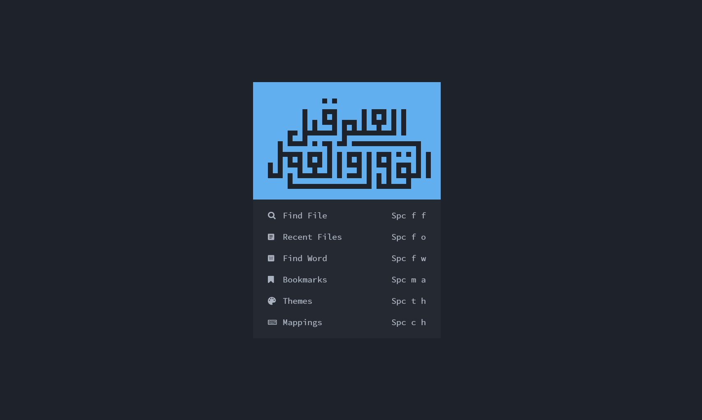
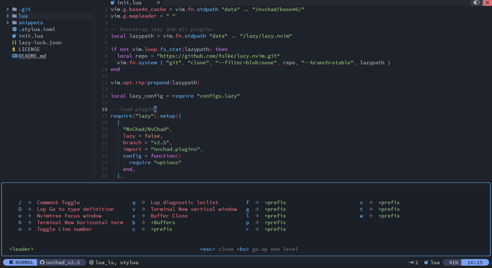

# starter

Starter config for NvChad

## HOME



## CODE



- Linux :

```bash
git clone https://github.com/pojokcodeid/NvChad-v2-config.git ~/.config/nvim
```

- Windows

```pwsh
git clone https://github.com/pojokcodeid/NvChad-v2-config.git "$env:LOCALAPPDATA\nvim"
```
